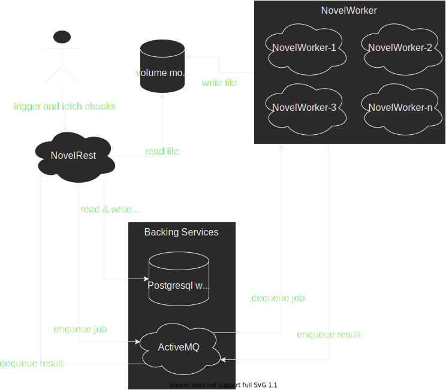
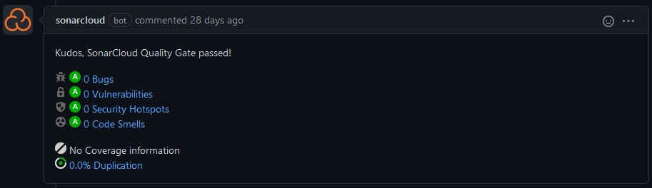

__WIP__
# Report

From Xiang Rong Lin for the lecture "cloud computing" at "Hochschule für Technik Stuttgart".

## Table of contents
[Motivation](#motivation)  
[Problem definition](#problem_definition)  
[Approach](#approach)  
[Implementation](#implementation)  
[Evaluation](#evaluation)  
[Conclusion](#conclusion)  
[Time tracking](#time_tracking)  

<a name="motivation" />

## Motivation
I like to read web novel, but found reading on the phone very inconvenient because of its small screen size. Instead I would have hugely preferred to read it on my Kindle. Problem being how to get the website on the kindle, whose browser is very feature scarce.

### Novel2Go
At first I made an Android app [Novel2Go](https://github.com/XiangRongLin/Novel2Go), which although working, had a lot of problems.
1. Readability libraries for java and more specifically android are few around and not very good. I used [Crux](https://github.com/chimbori/crux) which produces fine content, but I noticed at some point that some sentences were missing.
2. eBook generation was horrendous. From Crux I received a `org.jsoup.nodes.Document`. With that I iterated over it's paragraphs and wrote the text to an `android.graphics.pdf.PdfDocument`. Only thing that I made sure was, that while writing a paragraph, it would add line breaks when a new word would write outside a A4 document. Same for new pages. This pdf would then be sent to [Amazons conversion feature](https://www.amazon.com/gp/sendtokindle/email) in hope they could generate a proper eBook out of it.

### Novel2GoExtractor
Using the core of Novel2Go I made a private version which used CLI tool for desktop which way better results. [Firefox readability](https://github.com/mozilla/readability) library was used through an CLI wrapper for extracting the content and [calibre](https://calibre-ebook.com/) `ebook-convert` used to convert the html page to an eBook. ANY eBook format was possible with this.  
But a java program which relies on the user having an JS CLI tool, thus NodeJS and NPM, and calibre installed is not very user friendly.

<a name="problem_definition" />

## Problem definition
With that in mind I wanted to make use of Docker by defining my own containers which had the necessary CLI tool pre-installed. In order to make it more interesting and to meet the complexity requirements of the lecture, I wanted to make a add all the "new and cool" stuff around a real project.  
More specifically this means:

1. Scalability by separating web extraction & eBook generation from the web API
2. Easy setup of the development environment
3. Docker image with CLI tools installed
4. CI pipeline which builds, tests and publishes artifacts (Tests themselves not included)
5. CD pipeline to deploy to the web

<a name="approach" />

## Approach
### Scalability by separating web extraction & eBook generation from the web API
I'm assumed that for a given job the worker will experience a way bigger workload than the API. Thus a single rest API instance could serve multiple worker instances.  
For the minimal viable product I wrote everything in a single codebase. An API call would trigger an message into the messaging system, which in turn would trigger the extraction and generation. The resulting eBook would be saved to disk and returned by the rest API. This allowed me to painlessly split it up afterwards into a rest API and worker service.

### Easy setup of the development environment
Here I used `docker compose`, because it's something that I already knew very well and could do quickly in order to not spend too much time here. In order to allow different configurations between the local dev and the production environment all config is done through files. The config files for the local dev environment would be provided and configured accordingly to the dependencies in `docker compose`.  
So in order to run the projects and get a running version locally for development one can simply follow the steps described in the readme.

### Docker image with CLI tools installed
I already knew which tools I needed by documenting it in the readme. So the only thing to do was to declare the installation in the Dockerfile.

### CI pipeline which builds, tests and publishes artifacts (Tests themselves not included)
I wanted to have an CI pipeline which would build the project and run their non-existent tests on every push to master an pull request. Additionally it would publish the maven artifacts and docker images, so that the rest API could access the worker.  
Tests themselves were excluded because they are not part of the curriculum of this lecture and would take too much time.

### CD pipeline to deploy to the web
Lastly I wanted to be able to use all of this from anywhere and maybe even an adjusted Novel2Go app. So it would need to be deployed somewhere. Ideally a single rest API instance and worker instance would be running at all times, with the possibility to scale the worker up based on usage.

### Architecture diagram


A user can only interact with NovelRest and trigger a job to download and convert an e-Book.  
Then some meta data of the job gets saved into the database and the job gets queued into ActiveMQ.  
Any of the NovelWorker instances can then dequeue the job and work on it.
It can be only a single instance running all jobs sequentially or multiple running them in parallel.  
After they are done the resulting e-Book gets written into a shared volume mount and a result message is sent back from NovelWorker to NovelRest through ActiveMQ.  
Now the user can query the book from NovelRest, which retrieves it from the shared volume mount.

<a name="implementation" />

## Implementation
Here I describe my implementation and problems of the project, which occurred roughly in the outlined order.

### Monolith
The beginning was comparatively easy.  
A docker-compose.yml with AMQ and PostgreSQL, although I stumbled a bit, because AMQ does no provide official images. Instead I used [rrmohr/activemq](https://hub.docker.com/r/rmohr/activemq/), which received it's last update 2 years ago.  
Then a maven project with Kotlin and Spring Boot for rapid initial development. Configure it to the local AMQ and PostgreSQL instances and make sure to pass the config in through files from outside. Add some endpoint to trigger and fetch results.  
Then copy over the Novel2GoExtractor code and try not to wonder what past me was thinking writing that piece of code.

### Dockerization
The part of installing readability and calibre that I portrayed as pretty easy turned out to be way more annoying than expected. After many trial and error attempts, because libraries were missing or outdated, I finally settled on a working version which can be found [here](https://github.com/NovelService/NovelWorker/blob/49f7d10a78093dfaa0c7c71fbcea56b83f56ec13/novel-worker-docker/Dockerfile). It felt like in the NodeJS world. Just simply install everything that you need and don't wonder about the huge `node_modules` folder, in this case the __1.1GB__ image.

This was also the first time, that the program was running on Linux and not my windows. This brought to light that my implementation for calling the command line only worked on windows, because I was opening the program `cmd` from the process, which only exists on windows. I solved it for now with a simple if check and using `sh` on Linux.

### Microservices
This part also went comparatively easy. Because I already implemented the monolith to work through the messaging system I could nearly just create a new spring boot project and copy over the infrastructure and worker code. Only problem was the definition of the message format would have to be copied, in order to be available in both projects. This I solved in my point below.  
I also decided to remove the PostgreSQL dependency from the worker and instead communicate the completion of a job through a message back. The rest API would then save the completion into the database. This way the only way to communicate with the worker is through the messaging system. The eBooks would still be saved to disk, where I had to make sure they were mounted to the same folder for both services.

### Multi module maven project
Although not really part of the curriculum, this is something that naturally comes with splitting up the codebase and thus included here.  
In order to allow importing the message definition of the worker service into the rest API service, the dependency has to be available through one of the maven repositories. Because I don't have a domain to register my packages under MavenCentral, I went with [JitPack](https://jitpack.io/). They build the project and serve the build artifacts free for open source. They even allow to only select specific submodules of a project, which I made use of. 
Both project consist of following modules now:

1. API: It contains the data format they expect when communicating with them, in short their data transfer objects (dto).
2. application: The application itself, so everything from spring boot, configuration parsing, database integration, controller, services, repositories. Basically everything.
3. docker: It contains a dockerfile from which an image will be build with the jar from the application module

With this the rest API import the API module of the worker service like [this](https://github.com/NovelService/NovelRest/blob/ed3b2e825d64eef93112e7150f9eb4b7e33c4870/pom.xml#L46).

I had big problems with the dependency version not being inherited to the submodule. In the single module setup one would define `spring-boot-starter-parent` as parent, which then would set all version. But that somehow didn't work in the multi module setup. So after wasting some time, I settled with looking up the compatible version from the parent pom and declaring them myself.

Before the multi module setup it would also generate it fat jar, a jar which contains all necessary dependencies. This had to be configured afterwards.

### CI build, test, publish
Here is used GitHub actions, because I'm very familiar with it and it's free for open source.  
The current version can be found [here](https://github.com/NovelService/NovelWorker/blob/49f7d10a78093dfaa0c7c71fbcea56b83f56ec13/.github/workflows/ci.yml) and in short it runs `mvn install` to build and test and `docker push` to publish the image.  

Each command runs as a separate job, `mvn install` on push and PR, `docker push` only on push.
But because each job has a completely new environment the `docker push` job does not have access to the image from the `mvn install` job.
I decided to solve it with the `upload-artifact` and `download-artifact` actions over just building it again.
Reason being that I want to add a job for end-to-end tests in the future, which would also need the image.

The images can be found https://hub.docker.com/repository/docker/xiangronglin/novel-rest and https://hub.docker.com/repository/docker/xiangronglin/novel-worker  
A new image currently just overrides the old one, which is fine for now, in order to not create too many images while it is still in the early stages of development.

Additionally a static code analysis tool was integrated in the form of [sonarcloud](https://sonarcloud.io/).
It offers its services for free for open source project and helps in producing cleaner code by analyzing it during each PR and push.
For PR it also adds an comment with an quick overview of the quality of the changes

[](https://github.com/NovelService/NovelRest/pull/2#issuecomment-846546261)

Both projects [NovelRest](https://sonarcloud.io/dashboard?id=NovelService_NovelRest) and [NovelWorker](https://sonarcloud.io/dashboard?id=NovelService_NovelWorker) are using it.  
The setup was especially easy because it offers an [Automatic Analysis](https://sonarcloud.io/documentation/analysis/automatic-analysis/) in specific cases.
Both project fulfill those requirements.
Otherwise a maven plugin would need to be included, which would upload the analysis result.

### CD Deploy to the cloud
This was not achieved due to personal time constraints

<a name="evaluation" />

## Evaluation
Here I will evaluate my project based on the the requirements of a [Twelve-Factor App](https://12factor.net/)

### I. Codebase
Mostly checked: All the code is tracked with git and hosted on GitHub. There is some very small code duplication in the infrastructure classes, see `ConfigManager` and `AmqConfigurator`. This is acceptable, because they are only so similar right now, because they contain very little configuration. Shared code is extracted into a library (`novel-worker-API`) and declared as dependency in both the worker and rest API.
### II. Dependencies
Maven is used as build system and thus all JVM dependencies are declared and packaged with the application itself. The 2 outlier CLI tools are covered by releasing the app as a docker image and not a jar.
### III. Config
The configuration is done through a file, which has to be mounted into the image in order to be loaded by the app on runtime. For the local dev environment, program arguments were added to allow specifying where the default config files delivered with the projects are. Currently only very few values are configurable, because more was not needed, but the option to change them is there and very easy to realize.
### IV. Backing services
Backing services used by the worker is AMQ and by the rest API are AMQ and PostgreSQL. For both the URL and credentials are passed in through the config file, thus fulfilling this requirement.

Whether the AMQ or PostgreSQL service can be replaced on runtime is questionable. I would guess, that would throw an error with connection refused and not try to reconnect. But implementing an reconnect should be easy to achieve in order completely fulfill the requirement.
### V. Build, release, run
This is partly achieved. The project is build with GitHub actions with an CI job. If it was a push and not a PR then it also gets released immediately. Nearly no changes can be made on runtime because kotlin, a compiled language, is used. Only changes to the environments can be made by accessing the container. This should not be possible, because I planned to not open the SSH port on the production build.

### VI. Processes
The services are completely stateless, meaning they achieved this point. On one hand there is the database with its own volume and on the other hand there is the `/novel` folder, in which a volume has to be mounted in. In this folder the worker service writes the finished eBooks and the rest API fetches them.

### VII. Port binding
This is also achieved. The build process produces an "fat-jar" which contains all dependencies which are needed for the app (minus the CLI libraries). As can be seen in the `Dockerfile` declaration, those can be directly run.

### VIII. Concurrency
This was achieved completely. Taking the given docker-compose in this repository, one can run `docker compose up --scale novel-worker=x`, where x describes how many instances of the novel worker should be started. By running
```
for I in {1..y}; 
    do curl --location --request POST 'http://localhost:8080/novel/trigger' --header 'Content-Type: application/json' --data-raw '{"url": "https://insidethemirror1.wordpress.com/2021/05/16/chapter-18-reason/","tableOfContents": "false"}';
done
```
,with y being how many request should be sent, with multiple workers, one can see that the initial assumption about a single rest API instance being able to serve multiple worker instances being true. One can monitor the usage with `docker stats`. With this the whole application can easily scale horizontally.

### IX. Disposability
This is not achieved. The startup time is short for JVM standards, because very little has to be done on startup besides loading the config and connecting to the database and AMQ. What is missing, is returning jobs when the worker receives a SIGTERM signal. The resulting problem is that jobs may be cancelled due to SIGTERM, but not requeued and rerun, meaning they will never be finished.

### X. Dev/prod parity
Although no production environment exists, many points here could easily achieved. 

The `time gap` is minimal, because each push to master triggers the CI pipeline which in turn triggers the CD pipeline, when successful. The CD pipeline is missing, but if existent, new code would be running in production in a matter of minutes.

The `personnal gap` can't be properly evaluated, because it is a single person project.

The `tools gap` can be minimized, by using the same images for the backing services as in the services. 

### XI. Logs
Not handled.

### XII. Admin processes
Not handled, no one of processes exists. Initial database schema creation is handled by spring boot.

<a name="conclusion" />

## Conclusion
### Summary
Overall the project was an success. The first 4 points of the problem definition were achieved:
1. Horizontal scalability is allowed by using a queue and multiple stateless worker services
2. Complete dev environment setup is documented in the README
3. Docker images can be found here [NovelRest](https://hub.docker.com/repository/docker/xiangronglin/novel-rest) and [NovelWorker](https://hub.docker.com/repository/docker/xiangronglin/novel-worker) and are updated on each push
4. All PR and pushes are checked by an CI pipeline. Runs can be found here [NovelRest](https://github.com/NovelService/NovelRest/actions) and [NovelWorker](https://github.com/NovelService/NovelWorker/actions)

### Findings
Using docker from the start is a huge boon. All backing services can be started per command. Problems that would occur in the production environment can be found locally by running the app from an container instead of the IDE.

There are also many free services for open source project and students, that one should use in order to get experience while they are available for free. [JitPack](https://jitpack.io/) for maven artifacts, [sonarcloud](https://sonarcloud.io/) for static code analysis, [GitHub](https://github.com/) for CI/CD and code hosting

### Next steps
I plan to finish the last step of adding the CD pipeline and deploying the project into the cloud [NovelDeployer#1](https://github.com/NovelService/NovelDeployer/issues/1).

After that there are a lot of minor things, some of which I already mentioned throughout the report. Up-to-date issues can be found in the respective repositories, but for now these are:
1. Create and publish base image with readability and calibre preinstalled [NovelWorker#4](https://github.com/NovelService/NovelWorker/issues/4)
2. split up into 2 workers [NovelWorker#5](https://github.com/NovelService/NovelWorker/issues/5)
3. Return job on sigterm signal [NovelWorker#6](https://github.com/NovelService/NovelWorker/issues/6)
4. handle table of content jobs [NovelWorker#7](https://github.com/NovelService/NovelWorker/issues/7)
5. Validate input URL format [NovelRest#4](https://github.com/NovelService/NovelRest/issues/4)
6. Add suffix to docker images [NovelRest#5](https://github.com/NovelService/NovelRest/issues/5) [NovelWorker#8](https://github.com/NovelService/NovelWorker/issues/8)

I plan to have the project serve as an complete example of how to develop cloud native.  
There are many tutorials and examples available which dive into a single aspect, but complete projects are far in between. 

<a name="time_tracking" />

## Time tracking
|When|How long (minutes)|What|
|---|---|---|
|07.05.2021|90|spring with 2 endpoints, docker compose with postgresl|
|08.05.2021|90|inject config and save/retrieve from db|
|08.05.2021|90|amq integration, send and receive message. copy over extractor from private project|
|16.05.2021|50|Integrate extractor for single downloads|
|21.05.2021|60|file service for persistent file saving|
|21.05.2021|60|endpoint for fetching files and some bugs|
|21.05.2021|180|dockerize, get calibre installed correctly, mount volumes correctly|
|22.05.2021|300|Extract worker into separate codebase/microservice as maven multimodule project with seperate module for dto format|
|23.05.2021|240|Finish dockerization of both services. Create proper fat jars. Add ci job with mvn install and docker push|
|23.05.2021|120|Trigger Deployment repo job on worker/rest changes. Research deployment methods|
|24.05.2021|150|Report: Motivation, Approach, Implementation, Evaluation|
|26.05.2021|90|Novel-rest bugfixing, prepare live demo|
|27.05.2021|60|Report: Evaluation, conclusion. first version finished|
|27.05.2021|20|architecture diagram|